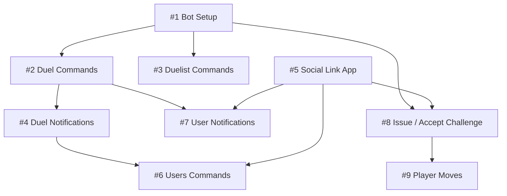

# pistols-discord-bot
A Discord bot for Pistols at 10 Blocks

## Project structure

`/discord-bot`: The Discord bot

* Cloned from [dojo.js/examples/node/torii-bot](https://github.com/dojoengine/dojo.js/tree/main/examples/node/torii-bot)
* [Setup instructions](/discord-bot/)

## Issue Dependency

