# pistols-discord-bot
A Discord bot for Pistols at 10 Blocks

## Project structure

`/discord-bot`: The Discord bot

`/social-app`: App that links Discord Users with their actual game Duelists

* Please take a look at [Setup instructions](/discord-bot/) before you start to collaborate
* It is recommended that every collaborator create their own bot and channel for testing
* We will send the test server invite link upon assignment

## Issue Dependency

```mermaid
graph TD;
  A[✅ #1 Bot Setup];
  C[✅ #3 Duelist Commands];
  B[✅ #2 Duel Commands];
  D[#4 Duel Notifications];
  E[✅ #5 Social Link App];
  F[#6 Discord Users Notifications];
  G[🏗️ #7 Discord Users Commands];
  H[#8 Issue / Accept Challenge];
  I[#9 Player Moves];
  J[🏗️ #14 New Duelists notification];
  K[#15 my_turn command];

  A-->C;
  A-->B;
  C-->J;
  D-->F;
  E-->F;
  J-->F;
  B-->G;
  E-->G;
  A-->H;
  E-->H;
  H-->I;
  G-->K;
  J-->D;

```

